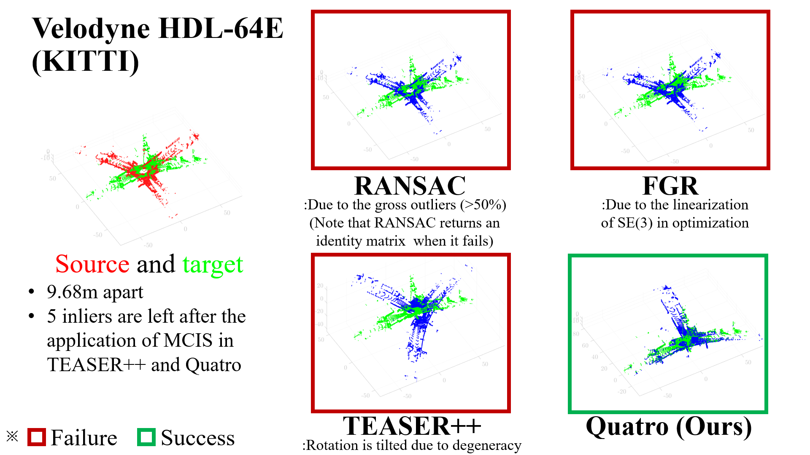
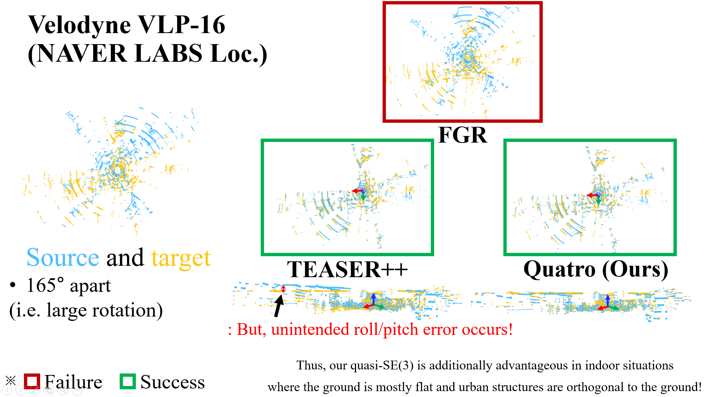
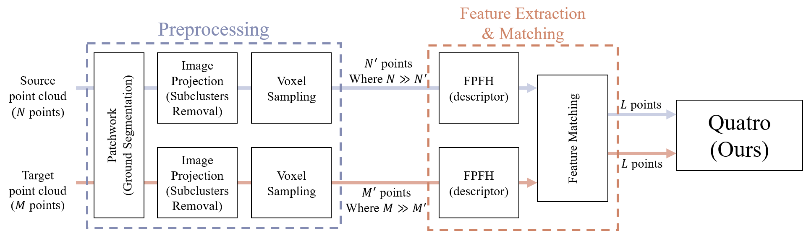
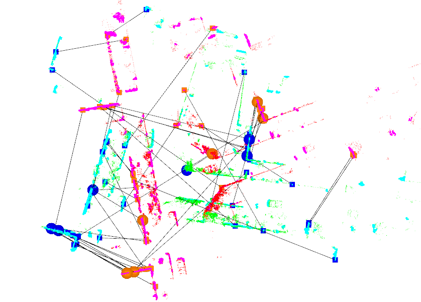
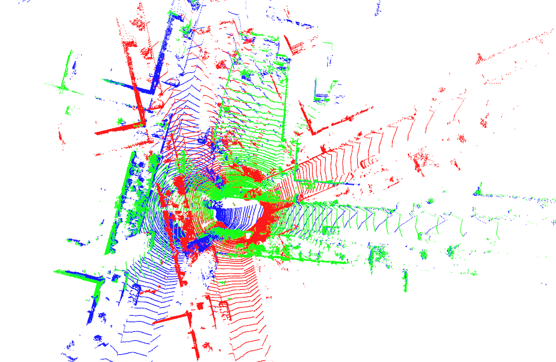

# Quatro 

Official page of *"A Single Correspondence Is Enough: Robust Global Registration to Avoid Degeneracy in Urban Environments"*, which is accepted @ ICRA'22. **NOTE that this repository is the re-implmenation, so it is not exactly same with the original version**.   

#### [Video] [Priprint Paper]

## Demo


## NEWS (23.1.27)
- An improved version is under review in the Interntaitonal Journal of Robotics Research~(IJRR)
- The codes would be refactored and then updated soon!

## Characteristics

* Single hpp file (`include/quatro.hpp`). It requires other hpp files, though :sweat_smile:
* Intuitive usage based on the hierarchical inheritance of the `Registration` class in [Point Cloud Library (PCL)](https://pointclouds.org/). Quatro can be used as follows: 

```c++
// After the declaration of Quatro,
quatro.setInputSource(srcMatched);
quatro.setInputTarget(tgtMatched);
Eigen::Matrix4d output;
quatro.computeTransformation(output);
```

* Robust global registration performance

  - As shown in the below figures, our method shows the most promising performance compared with other state-of-the-art methods.
  - It could be over-claim, yet our method would be more appropriate for terrestrial mobile platforms. Reducing the degree of freedom (DoF) usually makes algorithms be more robust against errors by projecting them into a lower dimension.
      - E.g. 3D-3D correspondences -> 3D-2D correspondences, LOAM -> LeGO-LOAM
  - In this context, our method is the dimension-reduced version of [TEASER++](https://github.com/MIT-SPARK/TEASER-plusplus)! 


KITTI dataset                  |  NAVER LABS Loc. dataset
:-------------------------:|:-------------------------:
 |  


#### Contributors

* Beomsoo Kim (as a research intern): `qjatn1208@naver.com`
* Daebeom Kim (as a research intern): `ted97k@naver.com`
* Hyungtae Lim: `shapelim@kaist.ac.kr`

#### ToDo

- [x] Add ROS support
- [x] Add demo videos
- [ ] Add preprint paper
- [ ] Add diverse examples for other sensor configuration

---

## Contents
1. [Test Env.](#Test-Env.)
0. [How to Build](#How-to-Build)
0. [How to Run Quatro](#How-to-Run-Quatro)
0. [Citation](#citation)

### Test Env.

The code is tested successfully at
* Linux 18.04 LTS
* ROS Melodic

## How to Build

### ROS Setting
1. Install the following dependencies

```
sudo apt install cmake libeigen3-dev libboost-all-dev
```

2. Install [ROS](http://torch.ch/docs/getting-started.html) on a machine.
3. Thereafter, [jsk-visualization](https://github.com/jsk-ros-pkg/jsk_visualization) is required to visualize Ground Likelihood Estimation status of [Patchwork](https://github.com/LimHyungTae/patchwork).

(Note that Patchwork is not directly related to Quatro. Patchwork is just used as preprocessing before feature extraction & matching. More details are [here](#How-to-Run-Quatro))

```bash
sudo apt-get install ros-melodic-jsk-recognition
sudo apt-get install ros-melodic-jsk-common-msgs
sudo apt-get install ros-melodic-jsk-rviz-plugins
```


* Then, run the following script. We use [catkin tools](https://catkin-tools.readthedocs.io/en/latest/),

```
mkdir -p ~/catkin_ws/src
cd ~/catkin_ws/src
git clone git@github.com:url-kaist/Quatro.git
cd Quatro && mkdir build && cd build
# To build Quatro, `pmc-src` should be placed in `build` directory in catkin workspace
# i.e. `~/catkin_ws/build/pmc-src`
cmake ..
mv pmc-src/ ../../../build/
cd ~/catkin_ws
catkin build quatro 
```

**Note that without `pmc-src`**, the below error occurs!

``` 
CMake Error at quatro/CMakeLists.txt:53 (add_subdirectory):
  add_subdirectory given source "~/catkin_ws/build/pmc-src" which
  is not an existing directory.
 ```

## How to Run Quatro

### Prerequisites

In this study, fast point feature histogram (FPFH) is utilized, which is widely used as a conventional descriptor for the registration. However, the original FPFH for a 3D point cloud captured by a 64-channel LiDAR sensor takes **tens of seconds**, which is too slow.  In summary, still, feature extraction & matching is the bottleneck for global registration :worried: (in fact, the accuracy is not very important because Quatro is extremely robust against outliers!).

For this reason, we employ voxel-sampled FPFH, which is preceded by voxel-sampling. This is followed by the correspondence test. In addition, we employ [Patchwork](https://arxiv.org/abs/2108.05560), which is the state-of-the-art method for ground segmentation, and image projection to reject some subclusters, which is proposed in [Le-GO-LOAM](https://github.com/RobustFieldAutonomyLab/LeGO-LOAM). These modules are not presented in our paper! 

Finally, we can reduce the computational time of feature extraction & matching, i.e. the front-end of global registration, from tens of seconds to almost 0.2 sec. The overall pipeline is as follows:



#### Note

For fine-tuning of the parameters to use this code in your own situations, please refer to `config` folder. In particular, for fine-tuning of Patchwork, please refer to [this Wiki](https://github.com/LimHyungTae/patchwork/wiki/4.-IMPORTANT:-Setting-Parameters-of-Patchwork-in-Your-Own-Env.)

### TL;DR
1. Download toy pcd bins files 
  
The point clouds are from the KITTI dataset, so these are captured by Velodyne-64-HDE

```
roscd quatro
cd materials
wget https://urserver.kaist.ac.kr/publicdata/quatro/000540.bin
wget https://urserver.kaist.ac.kr/publicdata/quatro/001319.bin
```

2. Launch the roslaunch file as follows:

```
OMP_NUM_THREADS=4 roslaunch quatro quatro.launch
```

(Unfortunately, for the first run, it shows rather slow and imprecise performance. It may be due to multi-thread issues.)

Visualized inner pipelines        |  Source (red), target (green), and the estimated output (blue)
:-------------------------:|:-------------------------:
 |  


## Citation

If our research has been helpful, please cite the below papers:

```
@article{lim2022quatro,
    title={A Single Correspondence Is Enough: Robust Global Registration to Avoid Degeneracy in Urban Environments},
    author={Lim, Hyungtae and Yeon, Suyong and Ryu, Suyong and Lee, Yonghan and Kim, Youngji and Yun, Jaeseong and Jung, Euigon and Lee, Donghwan and Myung, Hyun},
    booktitle={Proc. IEEE Int. Conf. Robot. Autom.},
    year={2022},
    pages={Accepted. To appear}
    }
```

```
@article{lim2021patchwork,
    title={Patchwork: Concentric Zone-based Region-wise Ground Segmentation with Ground Likelihood Estimation Using a 3D LiDAR Sensor},
    author={Lim, Hyungtae and Minho, Oh and Myung, Hyun},
    journal={IEEE Robot. Autom. Lett.},
    volume={6},
    number={4},
    pages={6458--6465},
    year={2021},
    }
```

## Acknowledgment
This work was supported by the Industry Core Technology Development Project, 20005062, Development of Artificial Intelligence Robot Autonomous Navigation Technology for Agile Movement in Crowded Space, funded by the Ministry of Trade, Industry & Energy (MOTIE, Republic of Korea) and by the research project “Development of A.I. based recognition, judgement and control solution for autonomous vehicle corresponding to atypical driving environment,” which is financed from the Ministry of Science and ICT (Republic of Korea) Contract No. 2019-0-00399. The student was supported by the BK21 FOUR from the Ministry of Education (Republic of Korea).

## License
<a rel="license" href="http://creativecommons.org/licenses/by-nc-sa/4.0/"></a><br />This work is licensed under a <a rel="license" href="http://creativecommons.org/licenses/by-nc-sa/4.0/">Creative Commons Attribution-NonCommercial-ShareAlike 4.0 International License</a>.


### Copyright
- All codes on this page are copyrighted by KAIST published under the Creative Commons Attribution-NonCommercial-ShareAlike 4.0 License. You must attribute the work in the manner specified by the author. You may not use the work for commercial purposes, and you may only distribute the resulting work under the same license if you alter, transform, or create the work.
